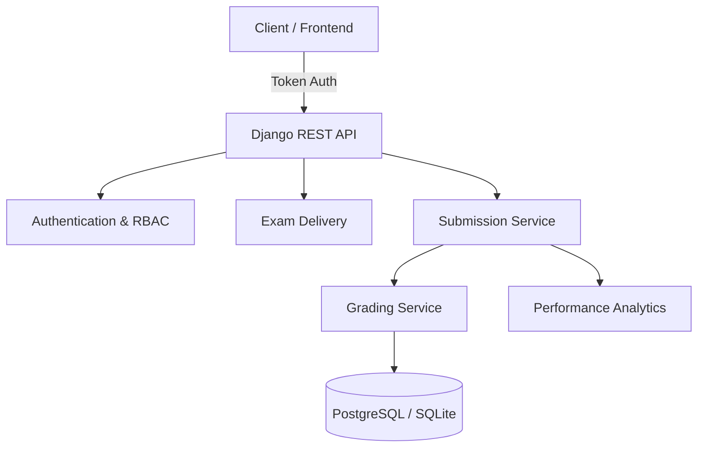
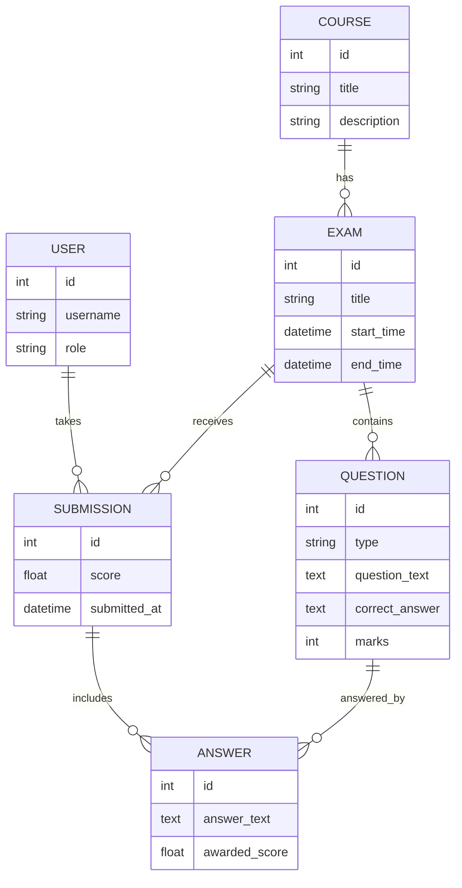

# 🧠 Mini Assessment Engine (Acad AI)

A production‑grade **Django REST Framework** backend for automated academic evaluations. Built to model real‑world assessment workflows with **secure exam delivery**, **instant grading**, and **actionable analytics**.

---

## 🎯 Problem Statement

Academic platforms require a secure way to deliver exams, prevent cheating, grade diverse question types instantly, and provide transparent performance analytics—without exposing answer keys or allowing duplicate submissions.
---

## 🚀 Core Features

### 🔐 Secure Authentication & RBAC

* Token‑based authentication
* Role‑Based Access Control (Student / Admin)
* Students can access **only their own exams and results**

### 📚 Course & Exam Management

* Relational structure:

  ```
  Course → Exam → Question
  ```
* Multiple exams per course
* Multiple question types per exam

### 🤖 Automated Grading Engine

Supports:

* MCQ
* True / False
* Short Answer
* Essay

Grading logic:

* Keyword matching
* Partial scoring
* Similarity‑based evaluation (extensible to AI/LLMs)

### 📊 Performance Analytics

* Pass rate calculation
* Average score per exam
* Historical trends per student

### 🧾 API Documentation

* Interactive **Swagger / OpenAPI 3.0** UI
* One‑click authentication for testing

### 🛡️ Data Integrity & Security

* Prevents duplicate exam submissions
* Answer keys are **never exposed** pre‑submission
* Immutable submission records

---

## 🏗️ System Architecture

### High‑Level Architecture



### Architectural Principles

* **Separation of concerns** (Views, Services, Permissions)
* **Service‑layer grading logic** (easy to swap with AI)
* **Read‑optimized serializers** for exam delivery
* **Write‑protected answer keys**

---

## 🧱 Database Design (ERD)



---

## 🧠 Grading Service Design

### `grading_service.py`

Responsibilities:

* Isolated grading logic
* Handles scoring for all question types
* Returns:

  * Awarded score
  * Feedback per question

Design benefits:

* Easily replaceable with AI‑based grading
* Fully testable in isolation

---

## 🔑 Permissions Model

### `permissions.py`

| Role    | Capability                                   |
| ------- | -------------------------------------------- |
| Student | Take exams, submit answers, view own results |
| Admin   | View all submissions, trigger regrading      |

Strict ownership checks prevent data leakage.

---

## 🛠️ Local Installation

```bash
# Clone repository
git clone https://github.com/your-username/assessment-engine.git
cd assessment-engine

# Virtual environment
python -m venv venv
source venv/bin/activate   # macOS/Linux
# venv\Scripts\activate    # Windows

# Dependencies
pip install -r requirements.txt
```

### Database Setup

```bash
python manage.py migrate
python create_sample_data.py
python manage.py runserver 8080
```

---

## 🧪 API Testing

### Swagger UI

* Visit: `http://127.0.0.1:8080/swagger/`
* Authenticate using:

  ```
  Token <your_token>
  ```

### Sample Submission

```bash
curl -X POST http://127.0.0.1:8080/api/submissions/submit/ \
 -H "Authorization: Token YOUR_TOKEN" \
 -H "Content-Type: application/json" \
 -d '{
   "exam_id": 1,
   "answers": [
     {"question_id": 1, "answer_text": "Polymorphism allows objects to take multiple forms."},
     {"question_id": 2, "answer_text": "Object Oriented Programming"},
     {"question_id": 3, "answer_text": "false"}
   ]
 }'
```

---

## 📡 API Endpoints

| Method | Endpoint                         | Description                      | Access        |
| ------ | -------------------------------- | -------------------------------- | ------------- |
| POST   | `/api/auth/token/`               | Login & get token                | Public        |
| GET    | `/api/exams/`                    | List exams                       | Student/Admin |
| GET    | `/api/exams/{id}/`               | Fetch questions (answers hidden) | Student/Admin |
| POST   | `/api/submissions/submit/`       | Submit exam                      | Student       |
| GET    | `/api/submissions/my_results/`   | View analytics                   | Student       |
| POST   | `/api/submissions/{id}/regrade/` | Regrade submission               | Admin         |

---

## ☁️ Deployment

Ready for:

* Render
* Railway
* Heroku

Uses:

* **Gunicorn** (WSGI)
* **WhiteNoise** (static files)

---

## ✨ Author

**Victor Samuel**
Backend Engineer | Django & REST APIs

---

